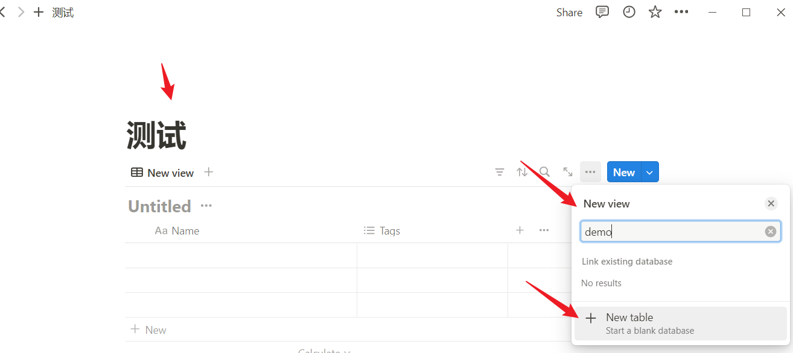
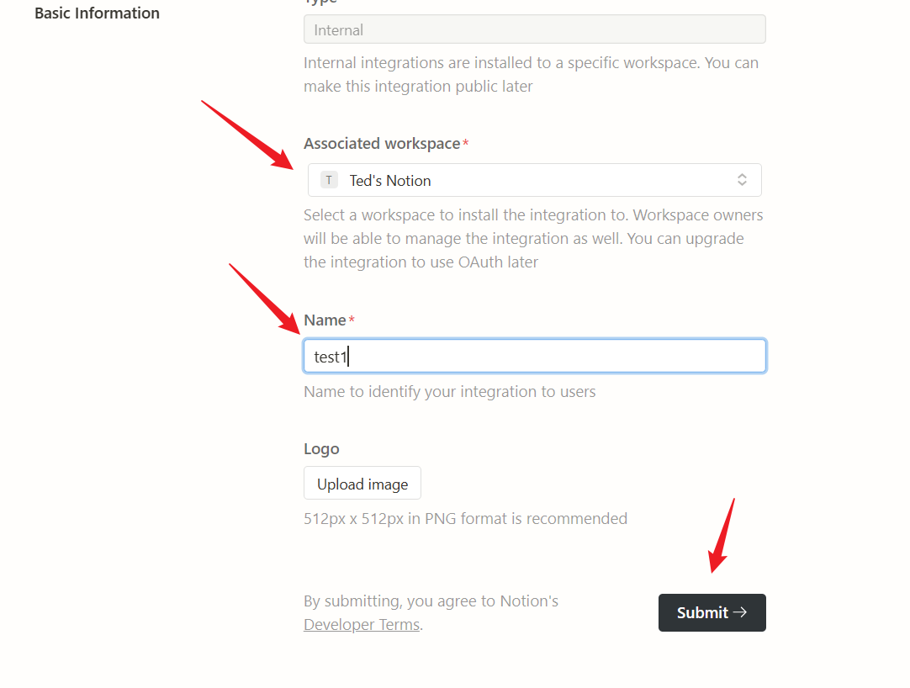
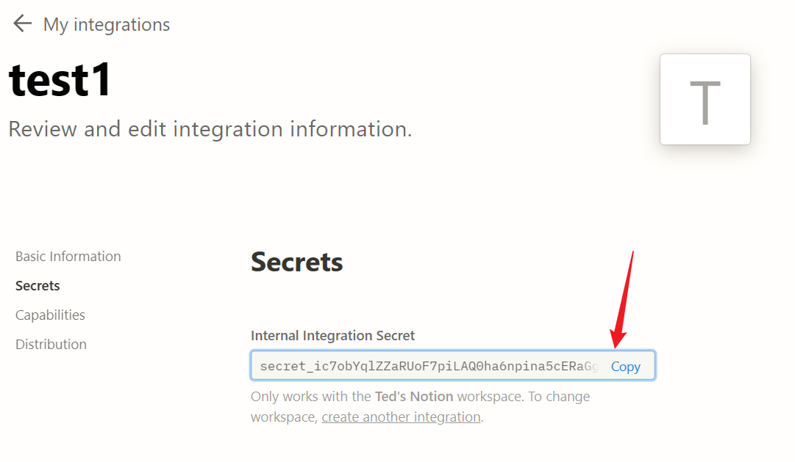
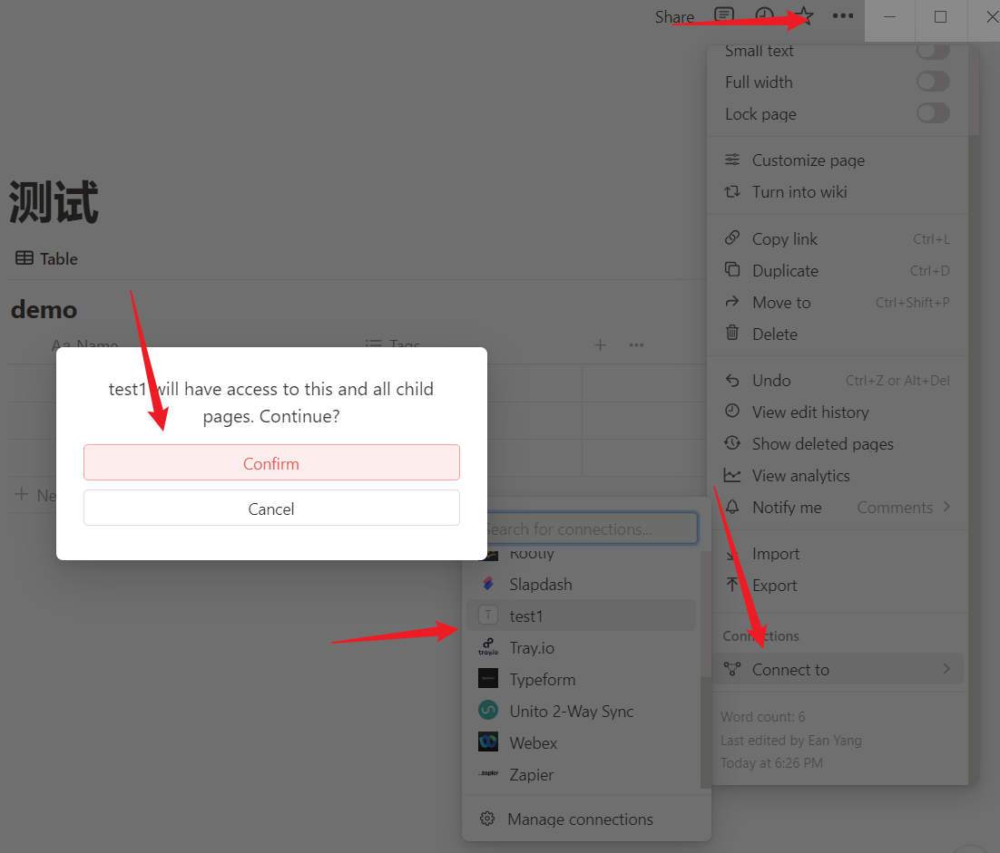
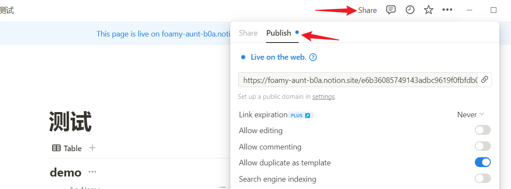
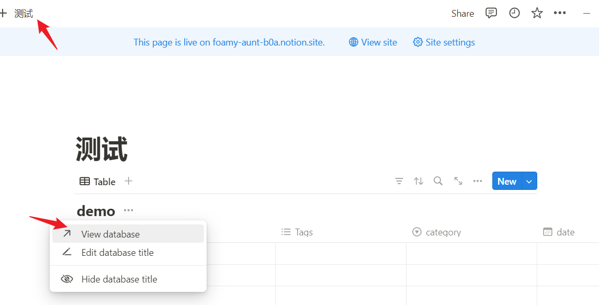
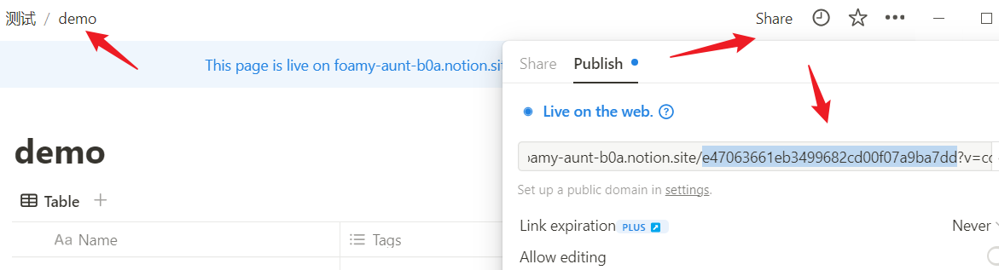

## 1.创建一个新页面

创建一个表格视图的页面

## 2.创建notion 集成

在[My integrations | Notion Developers](https://www.notion.so/my-integrations)中新建一个集成

### 复制密钥

把复制的密钥填入`.env`文件的`API_KEY`字段

 

## 3.连接集成

在Notion页面中连接自己刚才创建的集成

 

## 4.发布页面

  

### 复制表格数据库的id

> 注意：是数据库的id而不是主页面的id

先进入到数据库中

 

进入数据库页面后

 

在数据库的页面的分享链接中，选出需要的Notion页面id,填入到中`.env`文件的`DATABASE_ID`字段

例如`https://foamy-aunt-b0a.notion.site/e47063661eb3499682cd00f07a9ba7dd?v=ccf138790af9493180217f341ec1e04b&pvs=4`中的id字段是`/`和`?`之间的`e47063661eb3499682cd00f07a9ba7dd`

## 指定markdown文件目录

填入markdown文件目录到`.env`文件的`BASE_DIRECTORY`字段

## 开始上传

确保markdown中使用的图片都已上传到图床后(没有引用本地图片)，开始执行`python main.py`